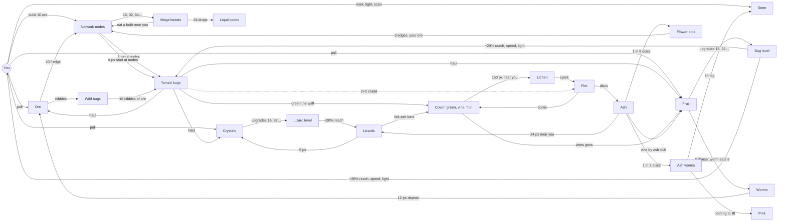

# Player influences, but the system has its own trajectory

The control panel for b4's ecosystem: every micro-interaction between the systems, as links that can be
read, tuned and corrected one at a time, and the feedback loops they add up to. The aim is to steer the
game's **macro trajectory** (what a session turns into over 10, 30, 60 minutes) by changing **micro links**
(one number, one condition), never by adding a system on top.

- **State:** b4.64 (D147), 2026-09-28. Read from the code (`spelunking/src/bundles/b4/`, `src/sim/dig/bugs.js`),
  not from memory. Every number is the default knob; the dev panel tunes most of them live (`k=` in the URL).
- **How to use it:** to change the trajectory, find the loop (§5), pick the link (§4) that sets its speed or
  its cap, change that link's number or condition. Update this file in the same commit as the code
  (id, number, decision).
- **Sign:** `+` more of A gives more of B; `−` more of A gives less of B. A loop with an even number of `−`
  links reinforces (R), an odd number balances (B).

---

## 1. The map at a glance

---

## 2. Stocks (what accumulates)

| Stock | Sources | Sinks | Player touches it by |
|---|---|---|---|
| **Ore** (ledger) | your pull, bug hauls, worm deposits (in the rock, then pulled) | edges (10 each, yours and flower bots'), wild bug nibbles (1 each) | pulling, building, standing near wild bugs |
| **Crystals** (ledger) | lizard burrows (5 px in the rock, then pulled by you or bugs) | lizard upgrades (16, 32, 64…) | pulling |
| **Fruit** (ledger) | your pull (within the light, seen or not), bug hauls (≤ 8 a trip) | bug upgrades (16, 32, 64…); in the world: worms eat it, fire burns it | pulling |
| **Pink** (ledger) | ash worms bursting with nothing left to reveal | **none** | none |
| **Liquid** (ledger + pools) | mega beast meals, 24 drops each | evaporation: each drop's 8 particles, one per pool surface pixel every 5 s (D149) | standing near bulbs (beasts eat only near you) |
| **Gas** (per node, every node a climate station) | evaporating pools: each particle to the nearest node through open pixels (never across rock); a station over `gas.cap` 8 passes half its surplus towards the nearest station with room in its cave (D150) | **none** yet ("we will do something with the gas levels", D149) | none directly |
| **Tamed bugs** (ledger) | 16 nibbles by wild bugs (D060), 1 per 4 built nodes reached (D145) | **none**: bugs never die | feeding wild bugs, building |
| **Bug level** | fruit spent automatically | never goes down | pulling fruit |
| **Lizard level** | crystals spent automatically | never goes down | pulling crystals |
| **Network** (built nodes, roots) | your builds, flower bots' builds | beast meals (a bulb and every root touching it) | building, riding |
| **Beasts** | 1 at 16 built nodes, the next at 32, 64… | **none**: they never leave (a ratchet) | building |
| **Cover** (green, vine, fruit on the back wall) | bugs green where they walk; vines grow on green | fire; worms eat fruit | indirectly, via where the network sends bugs |
| **Ash** (back wall) | fire, as discs of r 2–3 | lizards lick it bare; a blooming flower clears the ash touching it | none directly |
| **Seen** (fog lifted) | your light, your scan, ash worms | never goes down | walking, scanning |
| **Lichen patches** | 150 px of cover within 12 px, near you | never go; each sparks once | walking where cover is |

---

## 3. Actors (who does what, and whether you must be there)

"Near you" is the main way the player steers: those systems only act where the player is.

| Actor | Runs where | Does | Key numbers (knob) | Code |
|---|---|---|---|---|
| **You** | where you are | light reveals (8 px × gain), the scan reveals on touching rock (24 px), the pull takes the scarcest kind among fruit, ore, crystals in the light, 1 unit/s × gain; builds and rides roots | `light.base` 8, `scan.radius` 24, `pull.ticks` 60, `price` 10 | game.js |
| **Wild bugs** | **near you**: the 64 nearest 32 px fog blocks | up to 3 chase you through open air (≤ 20 steps), nibble 1 ledger ore every 40 ticks; every 16 nibbles (shared) tames the biter | `bugs.chasers` 3, `bugs.tame` 16, `bugs.nibbleTicks` 40 | bugs.js |
| **Tamed bugs** | **anywhere on the network**: each 30 s trip starts at the node with no vine and the fewest bugs within 32 px | random-walk the air (toward wall not green yet), green it, pull ore/crystals/fruit within 4 px (1 per 2 s), haul to the ledger | `swarm.tripTicks` 1800, `swarm.reach` 4, `swarm.pullTicks` 120, `swarm.fruitCarry` 8, `swarm.look` 8 | swarm.js |
| **Garden** | wherever it's green | 1 in 40 greened px starts a vine; a tip grows 1 px / 5 s; 12 px of vine make 1 fruit a minute; ×10 beside ash | `garden.sprout` 40, `garden.growTicks` 300, `garden.perFruit` 12, `garden.fruitTicks` 3600, `garden.hyper` 10 | garden.js |
| **Worms** | anywhere with 6 fruit within 12 px | step to fruit (through rock since b4.60), eat 8, curl into 12 px of ore in the rock | `worms.density` 6, `worms.eat` 8, `worms.max` 12 | worms.js |
| **Lichen** | spawns **near you** (64 px) where 150 px of cover is within 12 | once, 1 in 24 checks (every 5 s) with cover within 2 px: 3 embers, the fire runs through all connected cover | `lichen.density` 150, `lichen.spark` 24, `lichen.near` 64 | lichen.js |
| **Fire** | the connected cover | spreads 50% sideways / 25% diagonally per 0.1 s, burns 0.4 s; ash discs r 2–3 every 8–12 px | `garden.spread`, `garden.ash`, `garden.ashGap` | garden.js |
| **Flower bots** | 1 in 8 ash discs, anywhere | bloom after 2 min, fly to the nearest built node, travel to the network's rim, build 3 edges to new nodes (≥ 60 s apart, **your ore**), pop | `flowers.per` 8, `flowers.bloomTicks` 7200, `flowers.builds` 3 | flowers.js |
| **Ash worms** | 1 in 2 ash discs, anywhere | 12 s through rock toward the unseen, reveal 3 px round the head for good; nothing unseen within 64 px: burst, +1 pink | `ashworms.chance` 2, `ashworms.life` 720 | ashworms.js |
| **Lizards** | spawn **near you** (64 px) where 24 ash px are within 16, in caves ≥ 400 px | lick ash within 6 px bare, 1 per 1.5 s; after 27, burrow into 5 px of crystals | `lizards.density` 24, `lizards.max` 6, `lizards.eat` 27, `lizards.crystalPx` 5 | lizards.js |
| **Mega beasts** | eat **only bulbs within 50 px of you** (else they wait) | 1 joins at 16, 32, 64… built nodes; each eats every 5 min: the bulb and its roots go, 24 drops pool | `beasts.first` 16, `beasts.everyTicks` 18000, `beasts.near` 50 | beasts.js |
| **Upgrades** | the ledger, automatically | fruit 16, 32, 64… → bug level (+20% bug reach and speed, your light, pull radius, pull speed); crystals 16, 32… → lizard level (+20% lizard reach) | `swarm.upgradeCost` 16, `lizardUpgradeCost` 16, `upgradeGain` 0.2 | game.js |

---

## 4. Links (the micro-interactions)

Each row is one tunable interaction. **P?** = does the player's position or action gate it.

### Economy: ore, the network, bugs

| Id | From → To | Sign | Mechanism and rate | Knob | P? | Where |
|---|---|---|---|---|---|---|
| L01 | You → Ore | + | your pull, 1 unit/s × gain, within the light | `pull.ticks` | yes | game.js `pull` |
| L02 | Ore → Network | + | an edge costs 10 ore (yours, from a bulb) | `price` | yes | game.js `build` |
| L03 | Ore → Network | + | flower bots build with ledger ore; they wait at the rim while it's short | `price`, `flowers.*` | no | flowers.js |
| L04 | Network → Tamed bugs | + | +1 bug per 4 built nodes reached, never taken back | `nodesPerBug` | no | game.js `nodeTames` |
| L05 | Network → where bugs work | + | a bug arrives near a network node, and comes back near one after 30 s with no unit (it fades); between, it bounces round the caves | `swarm.spawn`, `swarm.crowd`, `swarm.idleTicks`, `bounce.*` | no | swarm.js `spawnAt`, bounce.js |
| L06 | Tamed bugs → Ore, Crystals, Fruit | + | a unit per 2 s within 4 px, each to the ledger at once; they stay while one is in reach and jump away when none is within 8 px | `swarm.pullTicks`, `swarm.reach`, `swarm.near` | no | swarm.js |
| L07 | Ore → Wild bugs → Tamed bugs | + | 3 chasers eat ore; 1 nibble = 1 bug (costs 1 ore; 16 until b4.69) | `bugs.tame`, `bugs.chasers` | yes (near you) | bugs.js `nibble` |
| L08 | Wild bugs → Ore | − | the nibbles drain the ledger; empty ledger: they ask ("?") | `bugs.nibbleTicks` | yes | bugs.js |
| L09 | Network → Beasts | + | 16, 32, 64… built nodes: +1 beast, forever | `beasts.first` | no | beasts.js |
| L10 | Beasts → Network | − | every 5 min each eats a built bulb 30–100 px from you with the least moss round it (≤ 8 px within 12): ~1.4 nodes and ~2 roots per meal (≈ 20 ore), may strand pieces | `beasts.everyTicks`, `beasts.nearMin`, `beasts.near`, `beasts.moss*` | yes | beasts.js `eat` |
| L11 | Beasts → Liquid | + | 24 drops a meal; pools shrink from the top as they evaporate (a 24-drop pool in ~2–4 min) | `beasts.drops` | yes | beasts.js |
| L42 | Liquid → Gas | + | 8 particles a drop, one per surface pixel every 5 s, to the station in the same cave | `gas.per`, `gas.everyTicks` | yes (clouds round the nodes, wisps from the pools) | gas.js |
| L43 | Gas → Gas (spread) | ± | a meal's 192 particles fill ~26 stations to 8 in ~5 s; a full cave evens out (111 stations in ~22 s) | `gas.cap`, `gas.spreadTicks` | yes (wisps between nodes) | gas.js `spread` |

### Garden: cover, fruit, worms

| Id | From → To | Sign | Mechanism and rate | Knob | P? | Where |
|---|---|---|---|---|---|---|
| L12 | Tamed bugs → Cover | + | green the wall round their path; where they crawl and land (b4.51's pull to bare wall gone in b4.70) | `garden.trail` | no | garden.js `greenAround` |
| L45 | Gas → Tamed bugs | ± | a bug meeting gas turns moth till it fades: it circles through the air laying moss instead of mining the walls | `bounce.moth*` | yes (amber moths vs pale jumpers) | swarm.js, bounce.js `mothTick` |
| L46 | Bugs → Predators | + | a crowd of 6 bugs within 24 px calls one, ≤ 1 per 4 built nodes | `predators.crowd`, `predators.perNodes` | yes (pink strings) | predators.js |
| L47 | Predators → Bugs | − | a bug touching the string is eaten; tamed ones leave the ledger for good | `predators.length`, `predators.meals` | yes | predators.js |
| L48 | Predators → Ore | + | 3 ore pixels in the rock by the anchor per bug eaten: the main ore replenisher (the user) | `predators.ore` | yes | predators.js |
| L49 | Gas → Tamed bugs (moths) | + | every 30 s each built node with gas hatches a moth: ~10 a beast meal, till the moss has used the gas up | `swarm.mothTicks` | yes | swarm.js |
| L44 | Gas → Cover | + (gate) | a bug greens a pixel only while its station holds gas; 1 gas a pixel, so a beast meal's 192 particles make at most 192 px of moss | `gas.perMoss` | yes (the clouds thin as moss appears) | garden.js `greenAround` |
| L13 | Cover → Vines | + | 1 in 40 greened px starts a vine; tips grow 1 px / 5 s on green only | `garden.sprout`, `garden.growTicks` | no | garden.js |
| L14 | Vines → Fruit | + | 12 px of vine: 1 fruit a minute | `garden.perFruit`, `garden.fruitTicks` | no | garden.js |
| L15 | Vines by ash → Fruit | + | a vine pixel touching ash makes fruit ×10 | `garden.hyper` | no | garden.js |
| L16 | Vines → where bugs work | − | trips prefer nodes with no vine round them: the bugs move on from gardens | `swarm.crowd` | no | swarm.js |
| L17 | Fruit → Bug level | + | 16, 32, 64… fruit: level +1 | `swarm.upgradeCost` | no | game.js `tick` |
| L18 | Bug level → Bugs, You | + | +20% compounding: bug reach and speed, your light, pull radius and speed | `upgradeGain` | no | swarm.js, game.js `gain` |
| L19 | Fruit → Worms | + | 6 fruit within 12 px spawn a worm (≤ 12) | `worms.density`, `worms.max` | no | worms.js |
| L20 | Worms → Fruit | − | each eats 8 | `worms.eat` | no | worms.js |
| L21 | Worms → Ore | + | each becomes 12 px of ore in the rock (then pulled by you or bugs) | `worms.length` | no | worms.js |

### Fire and ash

| Id | From → To | Sign | Mechanism and rate | Knob | P? | Where |
|---|---|---|---|---|---|---|
| L22 | Cover → Lichen | + | 150 px of cover within 12 px spawns a lichen patch, **within 64 px of you** | `lichen.density`, `lichen.near` | yes | lichen.js |
| L23 | Lichen → Fire | + | 1 in 24 checks (every 5 s) with cover within 2 px: once per lichen | `lichen.spark` | no | lichen.js |
| L24 | Fire → Cover | − | burns all connected cover (vines and fruit too) | `garden.spread*` | no | garden.js |
| L40 | Tamed bugs → Fire | − | no cover within a tamed bug's 3×3 catches fire (spread, ember or disc flare-up); already burning pixels burn on | `garden.suppress` | no | garden.js `shielded` |
| L41 | Fire → Tamed bugs | − | a bug with fire within 6 px stands still until it's out (it still pulls) | `swarm.fireStop` | no | swarm.js `fireNear` |
| L25 | Fire → Ash | + | ash discs r 2–3, every 8–12 px | `garden.ash*` | no | garden.js |
| L26 | Ash → Flower bots | + | 1 in 8 discs; bloom after 2 min | `flowers.per`, `flowers.bloomTicks` | no | flowers.js |
| L27 | Flower bots → Network | + | 3 edges each to nodes not on the network yet (the rim), ≥ 60 s apart, then pop | `flowers.builds`, `flowers.buildGap` | no | flowers.js |
| L28 | Flower bloom → Ash | − | clears the ash touching the flower | none | no | flowers.js |
| L29 | Ash → Ash worms | + | 1 in 2 discs, 12 s | `ashworms.chance`, `ashworms.life` | no | ashworms.js |
| L30 | Ash worms → Seen | + | reveal 3 px round the head, for good | `ashworms.light` | no | ashworms.js |
| L31 | Ash worms → Pink | + | nothing unseen within 64 px: burst, +1 | `ashworms.sense` | no | ashworms.js |
| L32 | Ash → Lizards | + | 24 ash within 16 px spawns one, **within 64 px of you**, cave ≥ 400 px, ≤ 6 | `lizards.density`, `lizards.near`, `lizards.room` | yes | lizards.js |
| L33 | Lizards → Ash | − | lick 27 ash px bare (1 per 1.5 s) | `lizards.eat`, `lizards.mineTicks` | no | lizards.js |
| L34 | Lizards → Cover | + | bare wall can be greened again (undoes L25 locally) | none | no | lizards.js |
| L35 | Lizards → Crystals | + | 5 px of crystals in the rock per lizard | `lizards.crystalPx` | no | lizards.js |
| L36 | Crystals → Lizard level → Lizards | + | 16, 32… crystals: reach +20% | `lizardUpgradeCost` | no | game.js, lizards.js |

### Knowledge (the fog)

| Id | From → To | Sign | Mechanism and rate | Knob | P? | Where |
|---|---|---|---|---|---|---|
| L37 | You → Seen | + | light and scan | `light.base`, `scan.radius` | yes | game.js |
| L38 | Seen → Scan | − | the scan fires only if something within 24 px is unseen | none | yes | game.js `hidden` |
| L39 | Seen → Ash worms → Pink | − / + | the more is seen, the sooner ash worms burst into pink | `ashworms.sense` | no | ashworms.js |

---

## 5. Loops

| Loop | Type | Links | What it does | What caps it |
|---|---|---|---|---|
| **Network engine** | R | L02/L03 → L04 → L06 → L02 | nodes → bugs → ore → nodes | only the builders: you, and flower bots (ash-limited) |
| **Bug placement** | R | L03 → L05 → L12 | the network grows where bugs are, bugs work where the network is | L16 moves bugs off gardens |
| **Fruit upgrades** | R, slowing | L06 → L17 → L18 → L06 | fruit → level → bugs pull faster and farther | cost doubles: each level takes twice the fruit |
| **Wild taming** | R | L01 → L07 → L06 | ore → wild bugs → tamed bugs → ore | 3 chasers; 16 ore per bug; only near you |
| **Worm recycling** | B on fruit, R on ore | L19 → L20, L21 | dense fruit turns into ore | worm max 12; needs 6 fruit dense |
| **Garden burn cycle** | B | L12 → L22 → L23 → L24 | cover grows until a lichen near you sparks and burns it | lichen spawn needs you near (L22); each lichen fires once; the bugs' 3×3 squares survive (L40) |
| **Ash dividend** | R (through fire) | L24 → L25 → L26/L29/L32/L15 | every fire pays out flower bots, ash worms, lizards, hyper vines | fires are rare and need you near (L22) |
| **Ash cleanup** | B | L32 → L33 → L34 → L12 | lizards turn ash back into wall bugs can green | 6 lizards; spawn needs you near |
| **Lizard upgrades** | R, slowing | L35 → L36 → L33 | crystals → reach → more ash licked → more crystals | cost doubles |
| **Beast tax** | B, ratcheting | L09 → L10 | the bigger the network got, the more beasts eat | meals only near you; beasts never leave |
| **Exploration end** | B | L30 → L39 → L31 | as the fog runs out, ash worms turn into pink | none (pink has no sink) |

---

## 6. What the player controls, and what runs without them

**The player steers by being somewhere.** These only happen near you:

- lichen spawning (L22), and so **every new fire** and everything fire pays out (flowers, ash worms,
  lizards, hyper vines);
- lizard spawning (L32);
- wild bug taming (L07) and their drain (L08);
- beast meals (L10): stay away from your network and it's never eaten;
- your own pull, light and scan (L01, L37).

**Runs on its own** once started: tamed bugs, greening, vines, fruit, worms, the fire once lit, flower
bots, ash worms, both upgrade tracks, the beasts' count.

**Can't be stopped by the player** (by design since D145): tamed bugs keep coming from the network
(L04), and bugs never die, so the economy only grows.

**What the player can stall by staying away:** new fires (and with them flower bots, the only automatic
network growth), lizards and crystals, beast meals.

---

## 7. Measured trajectory (b4.61–b4.63)

Headless run, seed 1, 30 minutes, you standing still at the pod, a 32-node network grown the way flower bots
grow it, 12 tamed bugs (before D145's node bugs):

| Minute | Built nodes | Beasts | Meals | Ore unspent |
|---|---|---|---|---|
| 0 | 32 | 1 | 0 | 0 |
| 10 | 80 | 3 | 2 | 1,211 |
| 20 | 99 | 3 | 8 | 3,073 |
| 30 | 103 | 3 | 14 | 4,656 |

One beast meal on a flower-grown network: 1.4 nodes, 2 roots (200 meals on 16–128 nodes; size barely
matters). Stranded, still counted as built: 1 node at 16, 7 at 128.

**What it shows (to correct later):**

1. **Ore piles up.** 12 bugs bring ~180 ore a minute; flower bots spend 30 each. Nothing else spends ore at
   that scale, so the beasts' tax (≈ 20 ore a meal) never bites.
2. **Automatic growth is fire-limited, and fires are player-gated.** Flowers: 27 in the first 20 minutes, 3 in
   the last 10; the network plateaus around 100 nodes while the beasts keep eating.
3. **Three dead ends:** pink, gas and (by design) tamed bugs have no sink. Pink and gas collect with no
   effect on anything (liquid now drains into gas, D149).
4. **The beast ratchet:** beasts stay after the network shrinks back below their threshold.
5. **Stranded pieces count:** eaten inner bulbs leave islands that count toward built nodes (so toward
   L04's bugs and L09's beasts) but can't be ridden to from the pod.
6. **Not measured yet:** D145's node bugs (1 per 4 nodes) feed the network engine: a 100-node network is
   25 bugs on top of the tamed ones, which should raise the ore surplus further.

---

## 8. Change log

| Date | Build | Change |
|---|---|---|
| 2026-09-28 | b4.63 | First version: stocks, actors, 39 links, 11 loops, the idle measurement. |
| 2026-09-28 | b4.64 | Loot renamed crystals (D146); L40, the tamed bugs' fire suppression (D147). |
| 2026-09-28 | b4.66 | Liquid drains into Gas, a new stock per node (D149); L42. |
| 2026-09-28 | b4.67 | Gas spreads from saturated stations through the cave (D150); L43. |
| 2026-09-28 | b4.68 | L41, tamed bugs stand still near fire (D151). |
| 2026-09-28 | b4.69 | L44, moss costs gas (D152). |
| 2026-09-28 | b4.70 | Wall-bouncing bugs, units to the ledger at once, taming costs 1 (D153): L05, L06, L07, L12. |
| 2026-09-28 | b4.71 | L45, bugs in gas turn moth (D154). |
| 2026-09-28 | b4.72 | Predators, a new actor: L46–L48 (D155). |
| 2026-09-28 | b4.73 | Predators haul (D156); no fruit for bugs, gas-first returns (D157, L06); 5× gas (D158, L42); hives, L49 (D159). |
| 2026-09-28 | b4.74 | Hives twice as often (D160, L49). |
| 2026-09-28 | b4.75 | Hives gone; L49 is now gas nodes hatching moths (D161). |
| 2026-09-28 | b4.76 | L10: beasts eat away from you, where there's no moss (D162); moss now shields bulbs. |
